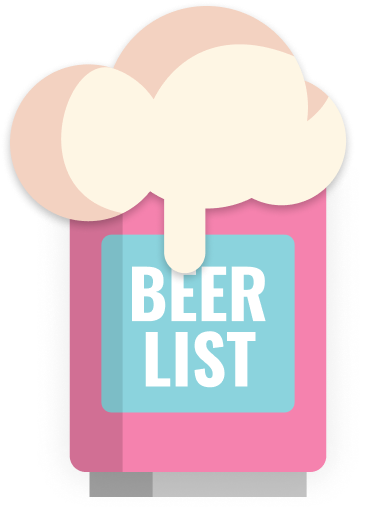

<p align="center">
  <strong style="color: red;">:construction::fire::construction_worker: WORK IN PROGRESS :construction_worker::fire::construction:</strong>
</p>

<p align="center">
    <a href="https://squidfunk.github.io/mkdocs-material/">
        
    </a>
</p>

<p align="center">
  <strong>
    A <br />
    <a href="https://beer.gigu.io/">Beer List</a>
    <br />
    for handling beer betting debts 
  </strong>
</p>

<p align="center">
  <a href="https://github.com/gigu-io/beerlist/issues"></a>
  <a href="https://github.com/sponsors/janlauber"></a>
  <a href="https://github.com/gigu-io/beerlist"></a>
  <a href="https://www.codefactor.io/repository/github/gigu-io/beerlist"></a>
</p>

<p align="center">
  See who owns me beer and how much I owe them. Also show the bet history. Choose between 3 different styles of beer (IPA, Lager, Stout) and 3 sizes (small, medium, big) for each bet.
</p>

<p align="center">
  <em>
    Check out the website – 
    <a
      href="https://beer.gigu.io/"
    >https://beer.gigu.io/</a>.
  </em>
</p>

<h2></h2>
<p>&nbsp;</p>

## Everything you would expect

### It's a simple web app

Focus on the beer list and the bet history.  
The app is simple and easy to use.  
Define who owns the beer and how much they owe you.

### Works on mobile and desktop

Because the app is a web app, it works on mobile and desktop.

### It's free

Everything is free (except the beer of course:wink:).  
If you want to support me, you can buy me a beer with a Github Sponsorship.  
Also you can host the app yourself.

### Open Source

Trust me, I'm open source.  
You can find the source code on [Github](https://github.com/gigu-io/beerlist).  
The frontend is written in Next.js and the backend is Firebase.  
License: MIT.

<h2></h2>
<p>&nbsp;</p>

## Setup Self Hosted

### Node.js

Make sure to install the dependencies:

```bash
# yarn
yarn install
```

#### Development Server

Start the development server on http://localhost:3000

```bash
yarn dev
```

##### Tailwind Reference

https://github.com/danvega/nuxt3-tailwind3-starter

#### Production

Build the application for production:

```bash
yarn build
```

Locally preview production build:

```bash
yarn preview
```

Checkout the [deployment documentation](https://v3.nuxtjs.org/docs/deployment) for more information.

### Docker

```bash
docker build . -t beerlist:local
docker run -p 3000:3000 beerlist:local
```

### Firebase

**TODO**